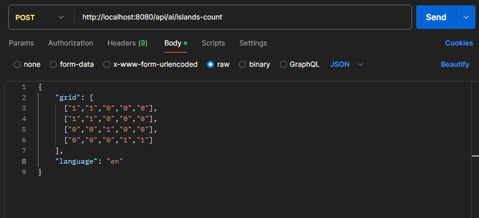
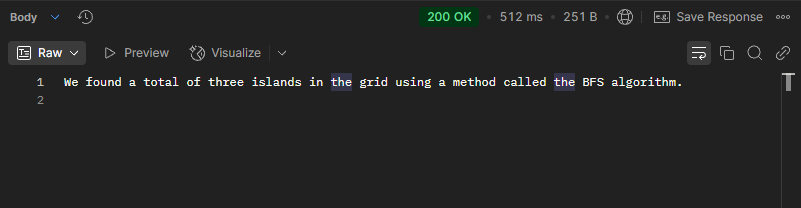

# 🌍 Island Counter with Spring Boot + Gemini (LangChain4j) + BFS + AI Explanation

This project is a **Spring Boot-based REST API** that processes a 2D map grid (with 1s as land and 0s as water), calculates the number of **islands** using the **Breadth-First Search (BFS)** algorithm, and responds with a **human-friendly explanation generated by a Language Model (LLM)** such as **Gemini** via **LangChain4j**.

It demonstrates how to combine classic algorithms with modern GenAI in a clean, explainable, and production-ready way using Java and Spring Boot.

---

## ✨ What It Does

- Accepts a grid of 1s and 0s via a POST /api/islands-count endpoint
- Allows specifying a **language code** (e.g., "en", "pt", "es") in the request body
- If no language is provided, it defaults to "en" (English)
- Uses a **BFS algorithm** to count the number of distinct islands
- Sends the result to an LLM (via LangChain4j) to generate a **natural language explanation**
- Streams back a friendly explanation for the user
- Supports both **Gemini (Google AI)** and optionally OpenAI

---

## 🛠️ Technologies Used

- ☕ Java 24
- 🧩 Spring Boot 3+
- 🤖 LangChain4j
- 🧠 Gemini (via langchain4j-google-cloud)
  
---

## 🚀 How to Run

### 1. 🧱 Clone the project

```bash
git clone https://github.com/pedrocarrijo95/springboot-gemini-bfs.git
cd springboot-gemini-bfs
```


### 2. ⚙️ Configure the application

Edit src/main/resources/application.properties or export environment variables:

```yaml
spring.application.name=springboot-gemini-bfs
GEMINI_API_KEY=<your_gemini_api_key>
GEMINI_MODEL_NAME=<model_name>
```


### 3. ▶️ Run the application

```bash
  mvn clean install
  java -jar target/springboot-gemini-bfs.jar
```

or

```bash
  mvn spring-boot:run
```





The server will be available at:

```bash
http://localhost:8080
```


```bash
curl -X POST http://localhost:8080/api/ai/islands-count \
  -H "Content-Type: application/json" \
  -d '{
    "grid": [
      ["1","1","0","0","0"],
      ["1","1","0","0","0"],
      ["0","0","1","0","0"],
      ["0","0","0","1","1"]
    ],
    "language": "en"
  }'
```


### 5. ▶️ Response Example
```bash
"Three islands were found on the map, calculated using the BFS algorithm. Each one represents a separate piece of land surrounded by water."
```




## ✅ Why This Matters
### This project is an example of:

Real-world Java + AI integration

How to build smart, explainable microservices

Applying classic algorithms (BFS) + LLMs for user-friendly output

Using open source and GenAI to solve problems in production-ready apps

## 🧠 Extra Ideas
🔀 Switch from BFS to DFS with a config flag

📈 Add metrics to track performance

🧩 Add front-end to visualize the grid and AI response


## Why Learning BFS Is Powerful in Real-World Systems

🔐 Cybersecurity
Track how malware or unauthorized access might propagate through a network

Identify breach paths and segment vulnerabilities in real time

🚗 Routing and Logistics
Find the shortest path in non-weighted graphs (e.g. package routing, delivery optimization)

Used in Waze, Google Maps, and logistics platforms

🌐 Social Networks and Graph Analysis
Determine if users are connected (even indirectly) via friends-of-friends logic

Power recommendation engines and community detection

🧠 Artificial Intelligence (AI)
Explore state spaces in games, planning systems, and simulations

Used in AI agents to find the most efficient decision path

🌍 Geospatial Systems
Detect and isolate zones of interest (e.g. islands, fire zones, flooded regions) in satellite images or maps
